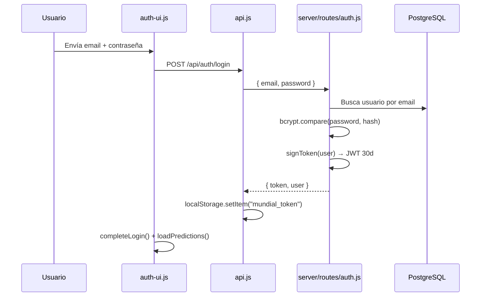
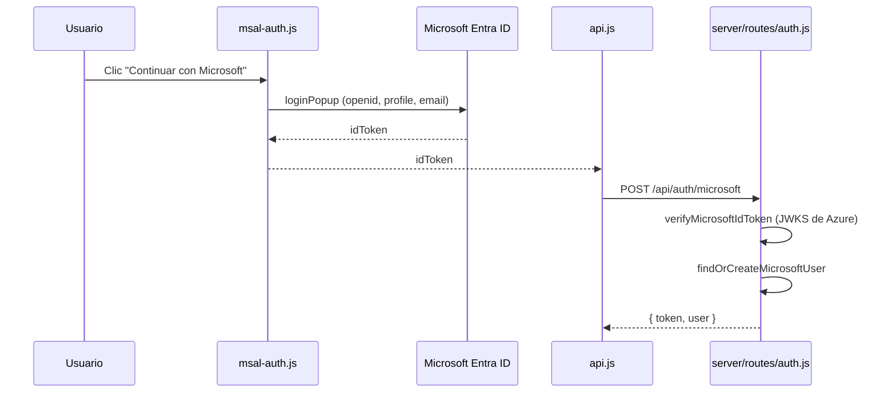

# Autenticación y login

Esta aplicación usa autenticación basada en **JWT** (JSON Web Token). Hay dos formas de iniciar sesión:

1. **Email y contraseña** (cuenta local)
2. **Microsoft** (Azure AD / Entra ID), si está configurado

El token se guarda en el navegador y se envía en cada petición protegida al backend.

## Resumen general

| Aspecto | Detalle |
|---------|---------|
| Almacenamiento del token | `localStorage` bajo la clave `mundial_token` |
| Duración del JWT | 30 días |
| Rutas de auth | `/api/auth/login`, `/api/auth/register`, `/api/auth/microsoft`, `/api/auth/me` |
| Rutas protegidas | Pronósticos (`requireAuth`), panel admin (`requireAdmin`) |

---

## 1. Interfaz (frontend)

La barra superior (`public/auth-ui.js`) muestra botones de **Iniciar sesión** y **Registrarse**. Al hacer clic se abre un modal con:

- Formulario email + contraseña (y nombre si es registro)
- Botón **Continuar con Microsoft** (solo si Azure está configurado)

Al cargar la página, `initAuth()` hace tres cosas importantes:

1. Inicializa MSAL (Microsoft) por si el usuario vuelve de un redirect de Azure
2. Si hay token en `localStorage`, llama a `GET /api/auth/me` para restaurar la sesión
3. Pinta la barra según si hay usuario logueado o no

Tras un login exitoso, `completeLogin()`:

- Guarda el token con `AuthAPI.setToken()`
- Actualiza `currentUser`
- Cierra el modal
- Carga los pronósticos del usuario
- Emite el evento `auth:change` para que otras partes de la UI reaccionen

Archivos relevantes:

- `public/auth-ui.js` — UI del modal, barra de auth y estado del usuario
- `public/api.js` — cliente HTTP y gestión del token
- `public/msal-auth.js` — integración con Microsoft (MSAL)

---

## 2. Login con email y contraseña



### Backend (`server/routes/auth.js`)

1. Busca el usuario por email en PostgreSQL
2. Compara la contraseña con el hash almacenado usando `bcrypt`
3. Si la cuenta es solo de Microsoft (sin `password_hash`), devuelve un error indicando que use el botón de Microsoft
4. Si todo es correcto, genera un JWT con `signToken()` y devuelve `{ token, user }`

### Registro (`POST /api/auth/register`)

Flujo similar al login:

1. Valida email, nombre (mín. 2 caracteres) y contraseña (mín. 6 caracteres)
2. Rechaza el registro si el email ya pertenece a una cuenta Microsoft
3. Hashea la contraseña con bcrypt
4. Crea el usuario con `auth_provider = 'local'`
5. Devuelve token + usuario (login automático tras registrarse)

---

## 3. Login con Microsoft



### Flujo en detalle

1. **`msal-auth.js`** carga la config pública desde `GET /api/auth/config` (`clientId`, `authority`)
2. Abre un popup de Microsoft (o procesa un redirect al volver a la app)
3. Obtiene un **idToken** de Azure
4. Lo envía al backend en `POST /api/auth/microsoft`
5. El servidor **verifica la firma** del token contra las claves públicas de Microsoft (JWKS)
6. Busca o crea el usuario por `microsoft_oid` o email (`findOrCreateMicrosoftUser`)
7. Devuelve el mismo JWT propio de la app que en el login local

### Vinculación de cuentas

- Si ya existe un usuario con el mismo `microsoft_oid`, se reutiliza
- Si existe un usuario local con el mismo email, se vincula actualizando `microsoft_oid`
- Si no existe, se crea un usuario nuevo con `auth_provider = 'microsoft'` y sin contraseña

### Configuración

Microsoft solo aparece en la UI si existe `AZURE_CLIENT_ID` en el servidor. La config pública se expone en `/api/auth/config`; la verificación del token usa `server/services/microsoft-auth.js`.

---

## 4. El JWT y las peticiones autenticadas

El token se firma en `server/middleware/auth.js`:

```js
function signToken(user) {
  return jwt.sign({ sub: user.id }, JWT_SECRET, { expiresIn: "30d" });
}
```

`JWT_SECRET` se toma de la variable de entorno `JWT_SECRET` (con un valor por defecto solo para desarrollo).

### Cliente (`public/api.js`)

En cada request, si hay token en `localStorage`, se adjunta automáticamente:

```
Authorization: Bearer <token>
```

### Middleware del servidor

`attachUser` verifica el JWT, carga el usuario de la BD y lo deja en `req.user`:

| Middleware | Uso | Requisito |
|------------|-----|-----------|
| `requireAuth` | Rutas de pronósticos (`/api/predictions/*`) | Usuario autenticado |
| `requireAdmin` | Panel de administración (`/api/admin/*`) | Usuario autenticado con `is_admin = true` |

`GET /api/auth/me` valida el token al recargar la página sin volver a pedir credenciales.

---

## 5. Cerrar sesión

`logout()` en `auth-ui.js`:

1. Borra el token de `localStorage` (`AuthAPI.setToken(null)`)
2. Pone `currentUser = null`
3. Limpia la caché de pronósticos
4. Vuelve a renderizar la barra de auth
5. Emite `auth:change` con `user: null`

No hay sesión en servidor: al quitar el JWT del cliente, la sesión termina desde el punto de vista de la app. El token sigue siendo válido técnicamente hasta que expire (30 días) o cambie `JWT_SECRET`.

---

## 6. Estado global accesible desde la UI

`window.AuthState` (definido en `auth-ui.js`) expone utilidades para el resto de la aplicación:

| Método / propiedad | Descripción |
|--------------------|-------------|
| `getUser()` | Usuario actual o `null` |
| `isLoggedIn()` | `true` si hay sesión activa |
| `isAdmin()` | `true` si el usuario es administrador |
| `refreshUser()` | Revalida el token contra `/api/auth/me` |
| `getPredictions()` | Pronósticos en caché del usuario |
| `savePrediction()` | Guarda un pronóstico vía API |
| `reloadPredictions()` | Recarga pronósticos desde el servidor |

El fixture y el panel admin consultan `AuthState` para decidir si mostrar inputs de pronóstico, la pestaña de administración u otras acciones restringidas.

---

## Diagrama de arquitectura

```
┌─────────────────────────────────────────────────────────────┐
│                        Navegador                            │
│  auth-ui.js ──► api.js ──► localStorage (mundial_token)     │
│       │              │                                      │
│       └── msal-auth.js (opcional, Microsoft)                │
└──────────────────────────┬──────────────────────────────────┘
                           │ Authorization: Bearer <JWT>
                           ▼
┌─────────────────────────────────────────────────────────────┐
│                     Express (server/)                       │
│  /api/auth/*     → routes/auth.js                           │
│  /api/predictions/* → requireAuth                           │
│  /api/admin/*    → requireAdmin                             │
│  middleware/auth.js → verifica JWT, carga req.user          │
└──────────────────────────┬──────────────────────────────────┘
                           ▼
                      PostgreSQL (users, predictions, …)
```

---

## Archivos clave

| Archivo | Rol |
|---------|-----|
| `public/auth-ui.js` | Modal, barra de sesión, `AuthState` |
| `public/api.js` | Cliente API y persistencia del token |
| `public/msal-auth.js` | Login con Microsoft (MSAL) |
| `server/routes/auth.js` | Login, registro, Microsoft, `/me` |
| `server/middleware/auth.js` | Firma y verificación de JWT, guards |
| `server/services/microsoft-auth.js` | Verificación de idToken de Azure |
